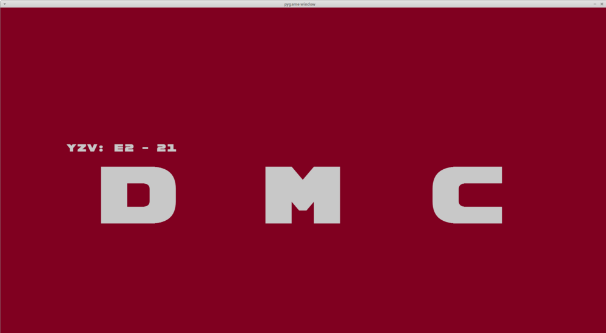
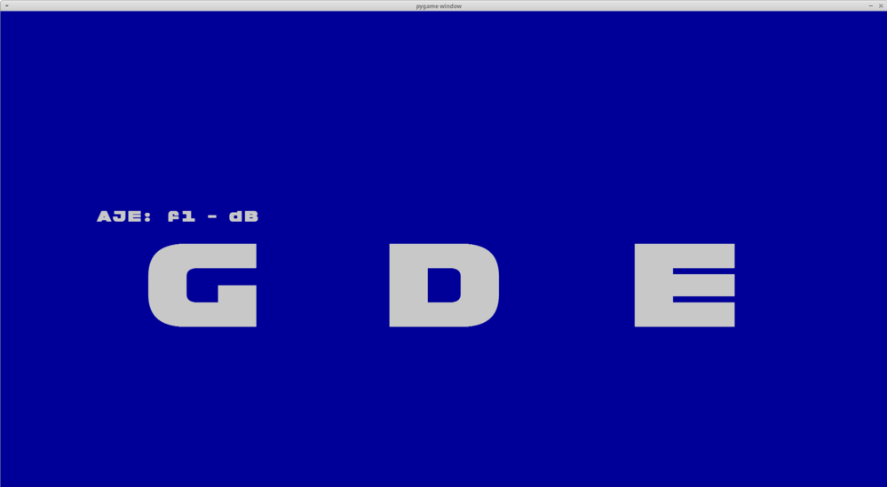
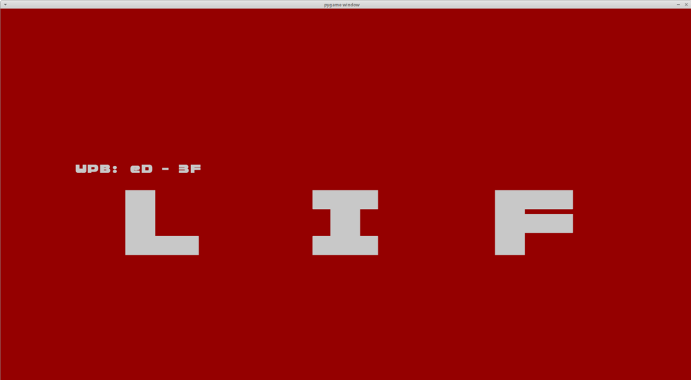
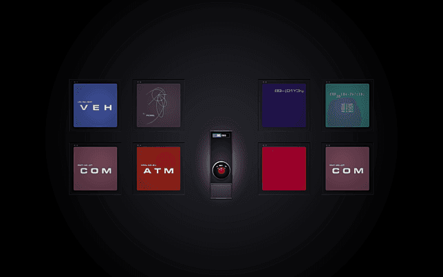
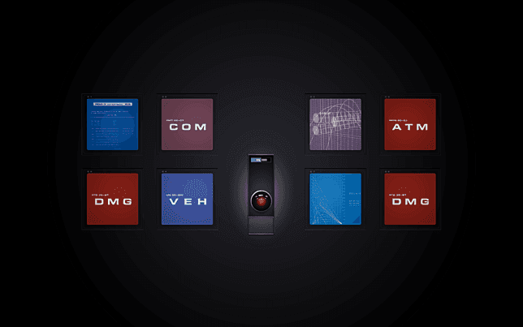
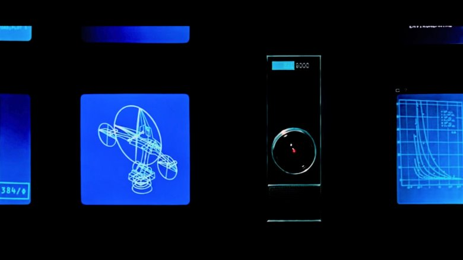
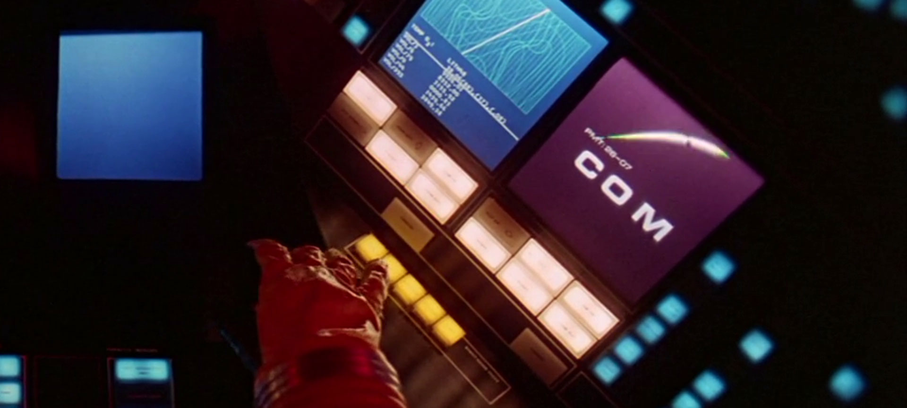

# 9000-Series System Status display tool

  

## Info 
### Design 

“A lot of the readouts were generic,” further explained Bruce Logan, the talented cameraman mentioned by Trumbull, “– nothing very carefully thought out. There just needed to be something moving on the viewscreens. Doug and I would strip up graphs and such, and then start blinking on lettering and numbers.” 

### Font  

"However, I do know that this section of the movie contains some absolutely Eurostile-tastic HAL 9000 screens"
Telemetry screens use "Manifold" from Selectric type Elements.

[Eurostile](https://www.myfonts.com/fonts/linotype/eurostile/bold-extended-2-63893/) costs to license.  Alternative options include [Michroma](https://fonts.google.com/specimen/Michroma), [Grammara](https://fonts2u.com/grammara-normal.font), and [Moki Mono](https://www.myfonts.com/fonts/facetype/moki/mono/).  

## statusscreen.py
The font spacing values have been calculated from the Moki font on an HD (1920x1080) screen, and using a different font or resolution would most likely require some changes.  But it's pretty close to the 9k sysinfo displays.  Will try and figure out how to add the graphs and text readout screens in some day. 

  
  

### System screens:
All system screens have a three-letter acronym or partial word, centered just below the middle of the scree.  Just above in a smaller text string, aligned to about half a letter's distance left of the main text box is a secondary string.  The substrings look to follow the form "ABC: WX - YZ", and use half-spaces.  The colors have a muted or dark feel to them, and the screens aren't overly bright in the text parts.  While this is probably due to the production of them, I've attempted to recreate that with the included color choices.  Tweak as you see fit, of course. 

From the film and screen shots:  
COM (purple)  
VEH (dark blue)  
NAV (dark blue)  
GDE (navy)  
CNT (green)  
NUC (dark blue)  
ATM (red)  
HIB (green)  
DMG (bright red)  
FLX (navy)  
LIF (red)  
MEM (blue)  
DMC (burgundy)  

Minimum screen time seems to be 5s per screen

## Other screens to try out in the future

### STAT screen: 
three columns of numbers,
"STAT" bottom left corner aligned, on inverted color text block. Green bg white text

### "vertical" Graphs (varying colors, mostly blue or dark red bg, all white text):
BL 78 (right side has column of values)  
ST 74  
SLOL  
CHMK  

### System screens
The AE-35 antenna is drawn on one screen when discussing troubleshooting it.

  

### Unnamed graphs (mostly lighter blue or aqua, at least one is purple bg, white lines):
horizontal single-line plot (2x)  
Map  
Radar  
spirals  

  

### Text screens (navy, white text):
numbers (left aligned one tab in)  
list of items, with numbers.  period-padded, a top item with indented sub-item list, four(?) LF spacing between various items

### IRL things

The crew Dragon docking screens can be seen [1](https://github.com/el-tocino/9000-series/blob/default/crewdragon-docking%20screens.png), [2](https://github.com/el-tocino/9000-series/blob/default/crewdragon-docking%20screens2.png), and [3](https://github.com/el-tocino/9000-series/blob/default/crewdragon-docking%20screens3.png) for comparison.

Other renderings of the spacex ui can be seen [here](https://www.designnews.com/sites/designnews.com/files/Design%20News/Dan%20Carney%20SpaceX%20Crew%20Dragon%20display_0.jpg) and [here](https://techcrunch.com/wp-content/uploads/2020/05/Screen-Shot-2020-05-30-at-5.06.14-PM.jpg)

### Other bits of note

How the displays were animated:  
https://aphelis.net/scratches-kubrick-2001-space-odyssey/  
  
Some images available here:  
https://www.screensaversplanet.com/screensavers/hal-9000-301/  
  
Typefaces used in 2001:  
https://typesetinthefuture.com/2014/01/31/2001-a-space-odyssey/  

Computer design documents:  
https://archive.computerhistory.org/resources/access/still-image/2010/09/102695548-03-01-acc.pdf  

HAL's voice:  
https://www.telegraph.co.uk/films/0/stanley-kubrick-douglas-rain-found-voice-hal-9000-accidentally/  
  
Douglas Rain, in Henry V:  
https://www.telegraph.co.uk/content/dam/films/2018/11/12/left_trans_NvBQzQNjv4BqLisXW7ze7DC8Ly7UG060poJV7v12XYxL1FnhYhkTH_E.jpg?imwidth=1240  
  
IMDB Page:  
https://www.imdb.com/title/tt0062622/   
  
Behind the scenes interview with Kubrick:  
https://ascmag.com/articles/filming-2001-a-space-odyssey  
  
HAL 9000 wiki page:  
https://en.wikipedia.org/wiki/HAL_9000  
  
Douglas Trumbull was murdered on set:  
https://www.hollywoodreporter.com/behind-screen/2001-a-space-odyssey-special-effects-pioneer-douglas-trumbull-remembers-stanley-kubrick-1114803  

  
